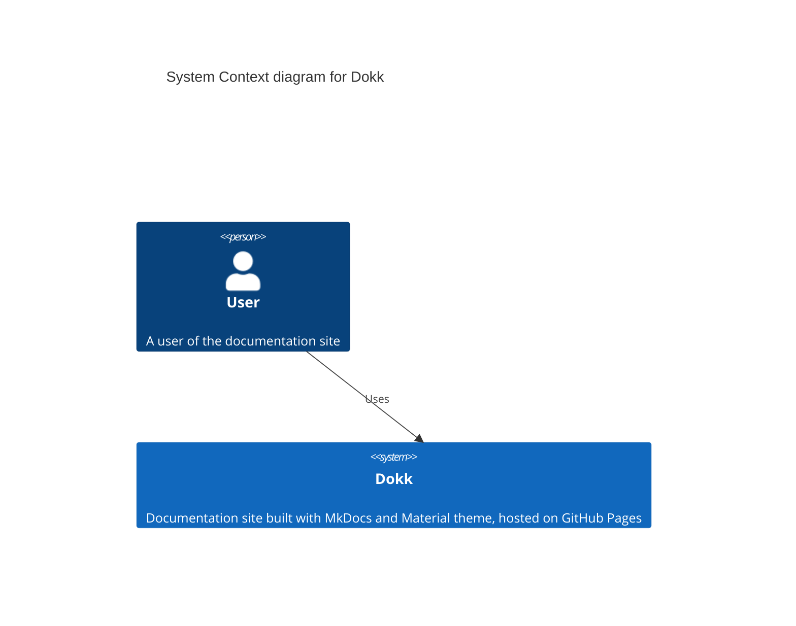
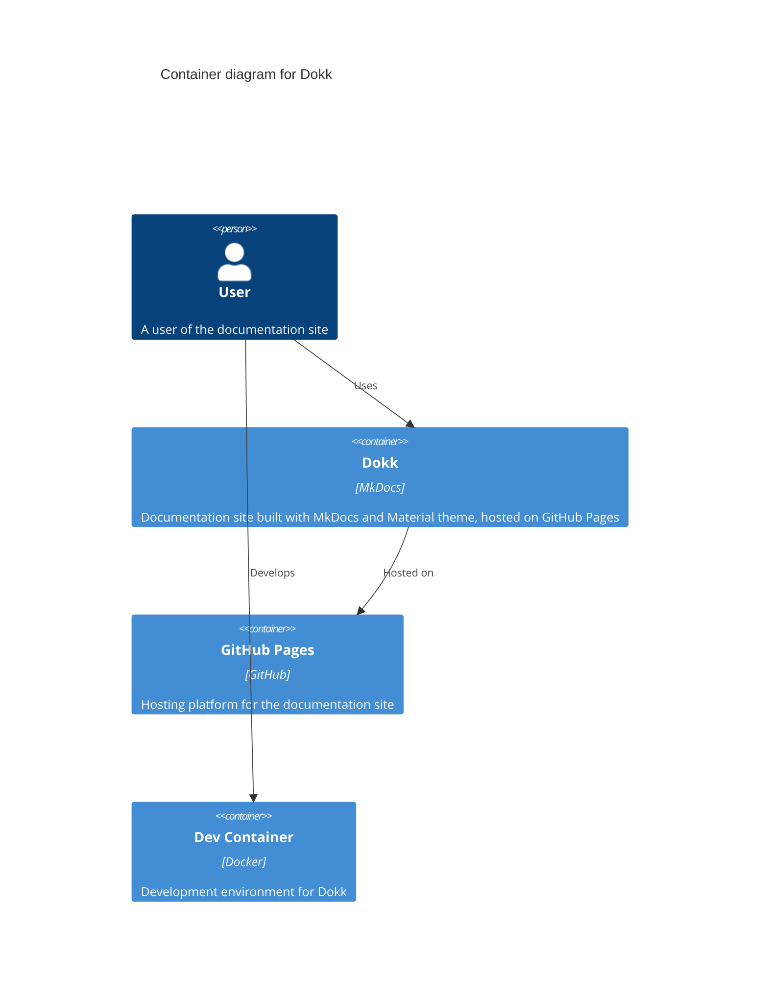
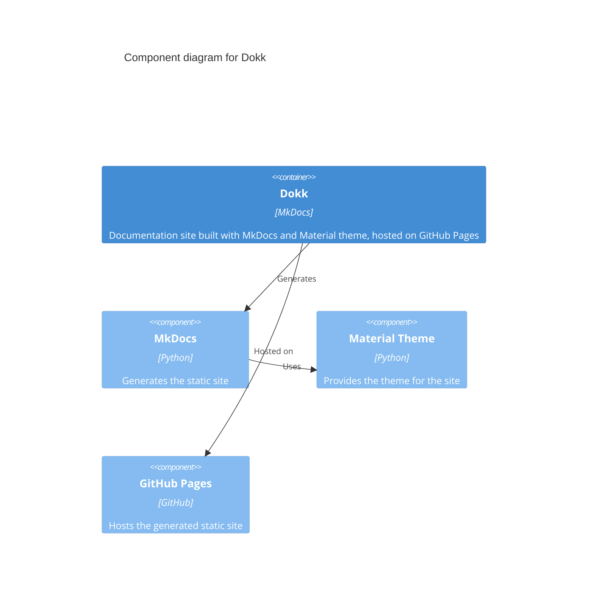
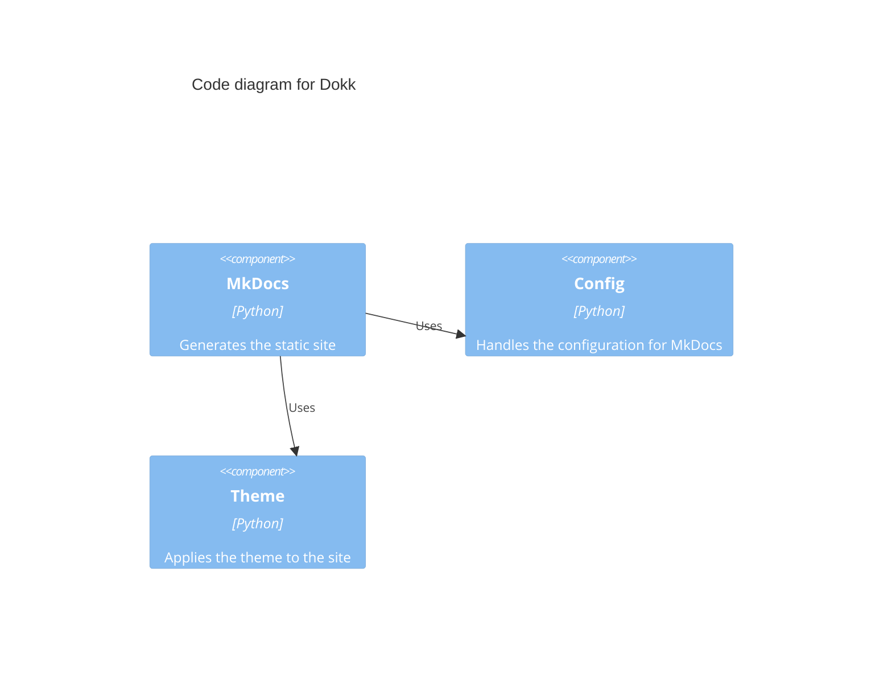

# Diagrams in Markdown

There are many ways to add diagrams to your Markdown documentation. Here are some popular options and their differences:

## Mermaid

[Mermaid](https://mermaid.js.org) turns simple text into diagrams like flowcharts and sequence diagrams. It is versatile and integrates seamlessly with Markdown, making it perfect for documentation on GitHub Pages.

- Easy to use, supports many types of diagrams, works well with GitHub Pages.
- GitHub Pages can display Mermaid diagrams without extra setup. See GitHub blog post [Include diagrams in your Markdown files with Mermaid](https://github.blog/developer-skills/github/include-diagrams-markdown-files-mermaid)
- Mermaid works well with Markdown, making it perfect not only for documentation on GitHub Pages.

To use Mermaid in Material for MkDocs, see Mermaid docs for [Diagrams](https://squidfunk.github.io/mkdocs-material/reference/diagrams)

### Examples of Mermaid C4 models

The following diagrams show the architecture of Dokk, a documentation site built with MkDocs and Material theme, and hosted on GitHub Pages.

> Note: These diagrams were mindlessly generated by AI and have been humanly checked for syntax errors. The Human is not very impressed, but the purpose here is to show how to use Mermaid for C4 modeling, not to create a perfect architecture diagram.

See the official documentation for Mermaid C4 modeling at [mermaid.js.org/syntax/c4.html](https://mermaid.js.org/syntax/c4.html).

## D2

D2 is a modern tool that makes it easy to create diagrams from simple text.

- **Pros**: Simple and easy to learn, good for quick diagrams.
- **Cons**: May require additional setup to work with GitHub Pages.

## PlantUML

PlantUML creates detailed diagrams from plain text descriptions.

- **Pros**: Supports a wide range of detailed diagrams, very powerful.
- **Cons**: Requires a server or local setup to render diagrams, more complex to integrate with GitHub Pages.

## Graphviz

Graphviz creates diagrams from text descriptions.

- **Pros**: Powerful and flexible, can create complex diagrams.
- **Cons**: May require additional tools and setup to work with GitHub Pages.
